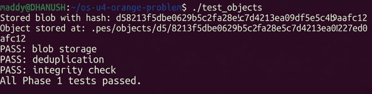
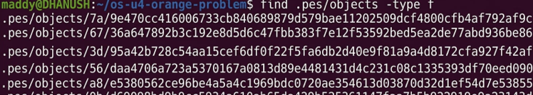
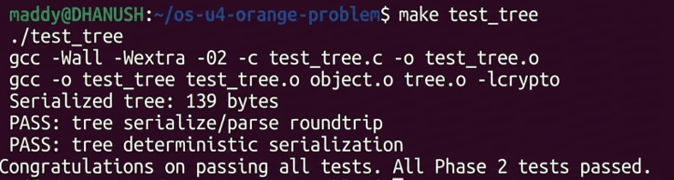
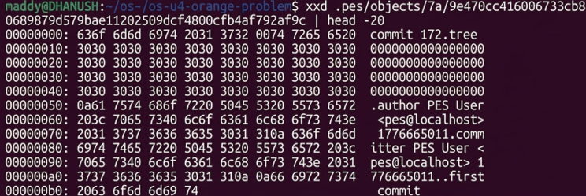
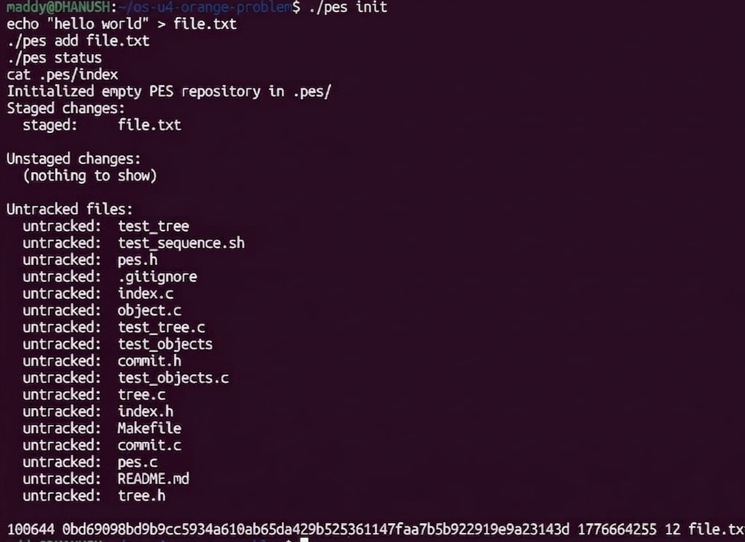
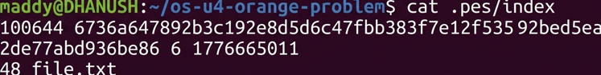
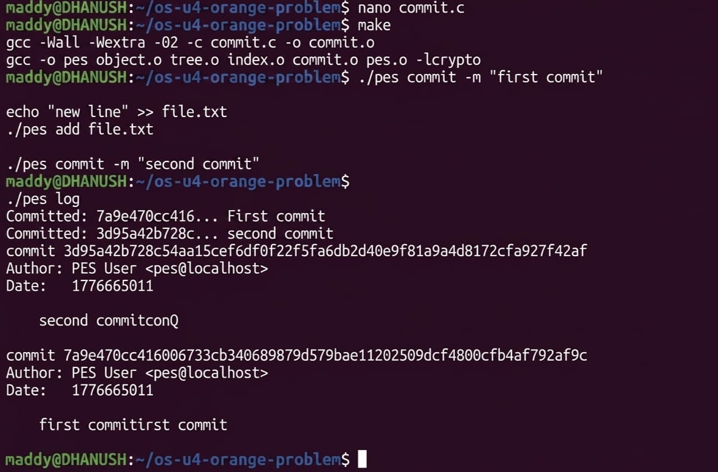
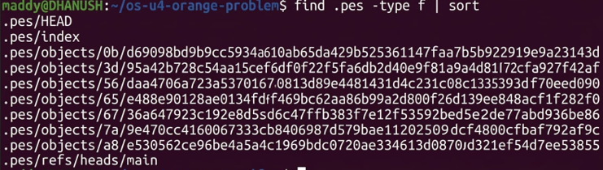

 Version Control System
 
 Overview

A simplified version control system (**PES**) inspired by Git.
Implements commits, checkout, conflict detection, and garbage collection.

 Features

* Branch checkout (`pes checkout`)
* Dirty file conflict detection
* Detached HEAD handling
* Garbage collection (mark & sweep)

 Screenshots

PES1UG24CS148
